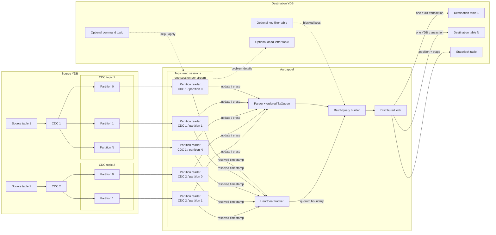
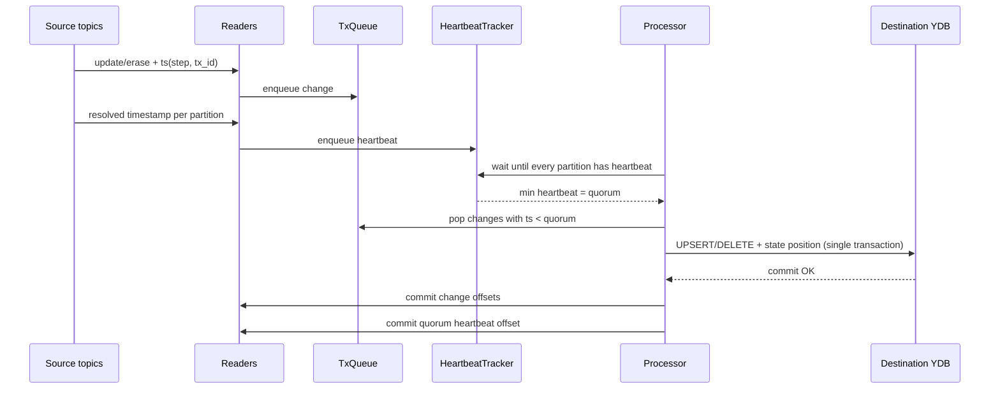
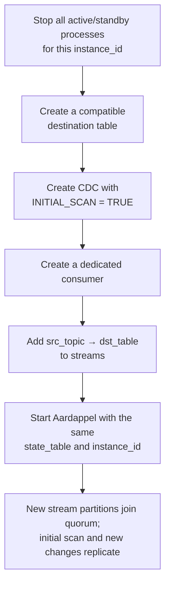
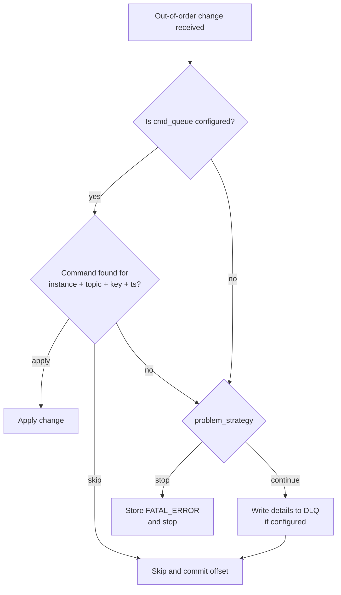
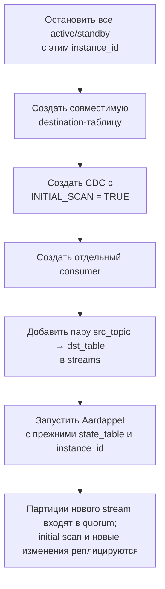
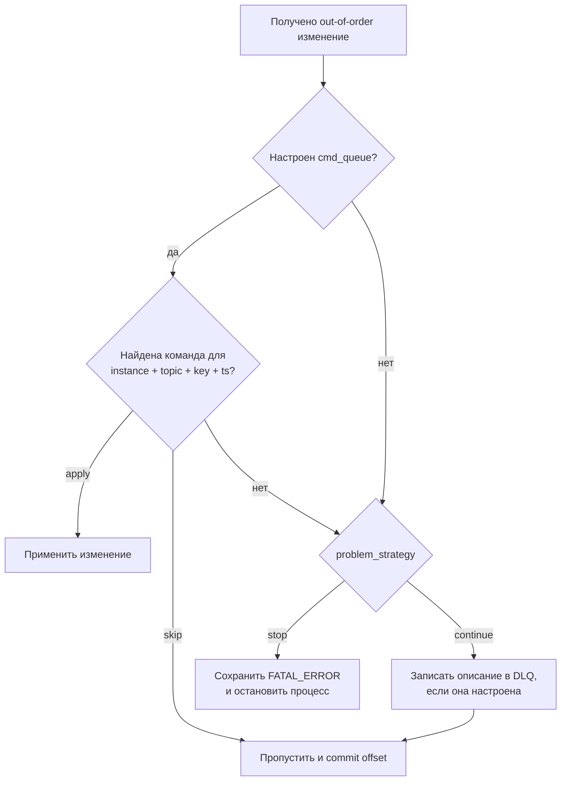

# Aardappel

[English](#aardappel) · [Русский](#aardappel-русский)

Aardappel is an asynchronous CDC replication service for YDB databases. It reads
changefeed topics from a source database, restores the global order of changes by
virtual timestamp, and atomically applies a consistent set of changes to tables in
the destination database.

Its main property is that changes from all configured streams that have reached a
common heartbeat boundary are written to the destination tables together with the
new replication position in a single YDB transaction. Topic message offsets are
committed only after that transaction has committed successfully.

## Contents

- [Architecture](#architecture)
- [Replication algorithm](#replication-algorithm)
- [Startup and recovery](#startup-and-recovery)
- [Preparing YDB](#preparing-ydb)
- [Configuration](#configuration)
- [Adding a new stream](#adding-a-new-stream)
- [Authentication](#authentication)
- [Problem message handling](#problem-message-handling)
- [Key filtering](#key-filtering)
- [Monitoring](#monitoring)
- [Build and run](#build-and-run)
- [Limitations and operational notes](#limitations-and-operational-notes)

## Architecture



A CDC changefeed is represented by a YDB topic and may contain multiple
partitions. Each `streams` entry creates one topic read session, while the YDB SDK
assigns reading of individual partitions inside that session. Therefore, every
partition has its own logical **partition reader** in the diagram. The replication
algorithm treats it as an elementary stream identified by
`(stream_id, partition_id)`.

Main components:

- `reader` creates a topic read session for every `streams` entry; messages from
  every assigned partition are handled as a separate stream, parsed from CDC JSON,
  and sent to `Processor`;
- `TxQueue` merges changes from all tables and orders them by `(step, tx_id)`;
- `HeartBeatTracker` stores the latest resolved timestamp for every partition of
  every stream;
- `Processor` selects a consistent batch, builds YQL for every destination table,
  and manages the replication position;
- `DstTable` reads the destination table schema and converts CDC values to its YDB
  types;
- `Locker` prevents two processes with the same `instance_id` from writing the
  replica concurrently.

## Replication algorithm

### Position and heartbeat quorum

CDC messages must contain virtual timestamps. A message position is the
lexicographically ordered pair:

```text
(step_a, tx_id_a) < (step_b, tx_id_b) when
step_a < step_b or (step_a == step_b and tx_id_a < tx_id_b)
```

A resolved timestamp arrives independently from the partition reader of each
partition. One CDC may have several partitions, and every partition independently
participates in calculating the common boundary. A quorum is ready only when a
heartbeat has been received from **every partition of every configured CDC
stream**. The safe boundary is the minimum of those heartbeats:

```text
quorum = min(last_resolved[stream, partition])
```

Every change whose position is strictly lower than the quorum could already have
arrived from every partition and can be applied in global order. A change equal to
the quorum is included in a later batch.



### Query construction

For one quorum, changes are distributed by `TableId`, which is the current index
of the entry in `streams`. Within each table:

- multiple updates to one key are merged into the final set of columns;
- the last operation for a key determines the final `UPSERT` or `DELETE`;
- UPSERT groups with the same column set are combined through `AS_TABLE`;
- parameter types are obtained from the actual destination table schema.

YQL for all destination tables and the replication position UPSERT into
`state_table` run in one transaction. This preserves atomicity between the tables
and the checkpoint.

### Committing messages

The operation order is essential:

1. Apply changes and update the checkpoint in destination YDB.
2. Successfully commit the YDB transaction.
3. Commit the offsets of CDC change messages.
4. Commit the offset of the quorum heartbeat.

If the process exits between steps 2 and 3, messages may be read again. On restart,
they are discarded using the stored position. Destination writes are therefore
idempotent at the checkpoint and final UPSERT/DELETE level, while topic delivery
is effectively at-least-once.

## Startup and recovery

### State table

The table is created automatically in destination YDB:

```sql
CREATE TABLE IF NOT EXISTS <state_table> (
    id Utf8,
    step_id Uint64,
    tx_id Uint64,
    state Utf8,
    stage Utf8,
    last_msg Utf8,
    lock_owner Utf8,
    lock_deadline Timestamp,
    PRIMARY KEY (id)
);
```

One row belongs to one `instance_id` and stores:

- checkpoint: `step_id`, `tx_id`;
- state: `OK` or `FATAL_ERROR`;
- stage: `INITIAL_SCAN` or `RUN`;
- the last fatal error;
- distributed lock owner and deadline.

On the first launch, a row is created with position `(0, 0)`, state `OK`, and
stage `INITIAL_SCAN`.

### INITIAL_SCAN

The initial stage establishes a stable common boundary for all streams:

1. Wait for the first complete heartbeat set.
2. Remember the maximum heartbeat in that set.
3. Wait for a quorum strictly greater than that maximum.
4. Apply accumulated changes before that position in batches of up to 1000
   messages.
5. Store the position and change the stage to `RUN` in the final transaction.

### RUN

In normal operation, each iteration waits for a quorum, selects all changes
strictly before it, atomically applies them, and stores the quorum as the new
checkpoint.

### Restart

At startup, `Processor` loads the row for its `instance_id`. Messages and
heartbeats older than the stored position are immediately committed without being
applied. If the stored state is not `OK`, automatic continuation is refused: fix
the cause and recover the state deliberately first.

### Multiple instances

Before reading source topics, the process acquires a lock in the row for its
`instance_id`. Lock TTL is `2 × max_expected_heartbeat_interval`.

- `multiple_instances_mode: true`: standby processes keep waiting and may take
  over after the lock is released;
- `multiple_instances_mode: false`: the process stops waiting after a series of
  failed checks, performed every 5 seconds.

Processes for independent replication sets sharing one state table need different
`instance_id` values. Active/standby processes for the same replication use the
same `instance_id` and identical stream configuration.

## Preparing YDB

### Source

Every source table needs a JSON `UPDATES` changefeed with virtual and resolved
timestamps, plus a consumer:

```bash
YDB_EXEC="ydb -e <DATABASE_ENDPOINT> -d <DATABASE_NAME>"

${YDB_EXEC} 'ALTER TABLE `<TABLE_NAME>` ADD CHANGEFEED `<CDC_NAME>` WITH (
  FORMAT = "JSON",
  MODE = "UPDATES",
  VIRTUAL_TIMESTAMPS = TRUE,
  RESOLVED_TIMESTAMPS = Interval("PT1S"),
  INITIAL_SCAN = TRUE
);'

${YDB_EXEC} 'ALTER TOPIC `<TABLE_NAME>/<CDC_NAME>` ADD CONSUMER `<CONSUMER_NAME>`;'
```

Enable `INITIAL_SCAN = TRUE` when the source table already contains data. The
changefeed then exports existing rows first and continues with new changes. It may
be omitted for a table guaranteed to be empty. Resolved timestamps may temporarily
stop during the initial scan, so Aardappel starts forming a heartbeat quorum after
the scan completes.

Every `streams` entry must reference such a topic and consumer. See the
[YDB initial scan documentation](https://ydb.tech/docs/en/yql/reference/syntax/alter_table/changefeed).

### Destination

Destination tables must be created in advance. For every source/destination pair:

- primary key column order and types must be compatible;
- CDC columns must exist in destination and have compatible types;
- the service account needs schema-read and data-write permissions;
- `state_table` must not conflict with an application table.

Aardappel does not require the complete source and destination schemas to be
identical. The practical requirement is that every source CDC message can be
applied to the corresponding destination table: all message columns must exist
and convert to destination types, and the key must match the destination primary
key.

Change schemas before dependent CDC messages appear. For example, add a compatible
column to destination first, then to source, and only then begin writing that
column in source. Otherwise Aardappel may receive a column unknown to its
destination schema and stop replication.

Each destination schema is read once at startup and cached in memory. Restart
Aardappel after a destination schema change, before dependent source messages are
produced. On restart, it runs `DescribeTable` again and refreshes its local schema.

## Configuration

The file is supplied through `-config`; the default is `config.yaml` in the current
directory. See the full example in
[`cmd/aardappel/config.yaml`](cmd/aardappel/config.yaml).

Configuration is read once at startup. There is no automatic reload: changing
connection strings, authentication, streams, queues, monitoring, or any other
setting requires an application restart.

```yaml
src_connection_string: "grpcs://source.example.net:2135/Root/source"
src_client_balancer: true
src_oauth2_file: "/run/secrets/source-oauth.json"
# src_static_token: "..."
# src_oauth2_endpoint: "https://sts.example.net/oauth2/token/exchange"

dst_connection_string: "grpcs://destination.example.net:2135/Root/destination"
dst_client_balancer: true
dst_oauth2_file: "/run/secrets/destination-oauth.json"
# dst_static_token: "..."
# dst_oauth2_endpoint: "https://sts.example.net/oauth2/token/exchange"

state_table: "/Root/aardappel_state"
instance_id: "orders-replica"
multiple_instances_mode: true
max_expected_heartbeat_interval: 10
log_level: "info"

streams:
  - src_topic: "/Root/orders/orders_cdc"
    consumer: "aardappel"
    dst_table: "/Root/orders_replica"
    problem_strategy: "stop"
    mon_tag: "orders"

mon_server:
  listen: ":8080"

# Optional:
# cmd_queue:
#   path: "/Root/aardappel_commands"
#   consumer: "aardappel"
# dead_letter_queue:
#   path: "/Root/aardappel_dlq"
# key_filter:
#   table_path: "/Root/aardappel_blocked_keys"
```

### Top-level settings

| Setting | Required | Purpose |
|---|---:|---|
| `src_connection_string` | yes | Source YDB connection string. |
| `src_client_balancer` | no | `false` enables `SingleConn`, useful when direct node access is unavailable. |
| `src_oauth2_file` / `src_static_token` | yes | Exactly one source authentication method. |
| `src_oauth2_endpoint` | no | Overrides the credentials-file token exchange endpoint. |
| `dst_connection_string` | yes | Destination YDB connection string. |
| `dst_client_balancer` | no | Equivalent destination setting. |
| `dst_oauth2_file` / `dst_static_token` | yes | Exactly one destination authentication method. |
| `dst_oauth2_endpoint` | no | Overrides the destination token exchange endpoint. |
| `state_table` | yes | Destination service table for state and locking. |
| `instance_id` | yes | Replication identifier and state table row key. |
| `multiple_instances_mode` | no | Keeps a standby process waiting for the lock. |
| `streams` | yes | CDC topic to destination table mappings. |
| `max_expected_heartbeat_interval` | recommended | Missing-heartbeat warning threshold and lock TTL input. |
| `log_level` | no | `debug`, `info`, `warn`, or `error`. |
| `mon_server` | no | Enables metrics and readiness HTTP endpoints. |
| `cmd_queue` | no | External `skip`/`apply` decisions for out-of-order messages. |
| `dead_letter_queue` | no | Diagnostic topic for problem transactions. |
| `key_filter` | no | Table of keys whose changes must not be applied. |

### `streams[]` settings

| Setting | Required | Purpose |
|---|---:|---|
| `src_topic` | yes | Source CDC topic path. |
| `consumer` | yes | Consumer in that topic. |
| `dst_table` | yes | Pre-created destination table path. |
| `problem_strategy` | no | `stop` (default) or `continue`. |
| `mon_tag` | no | `stream_tag` label; defaults to `src_topic`. |

A consumer must be exclusive to one concurrently running Aardappel replication
group. The same consumer name is fine in different CDC topics, but independent
instances must not read the same consumer of the same topic.

Stream order is not stored in the state table; only the common
`(step_id, tx_id)` position is stored. After restart, configuration is reread and
`TableId` is reassigned from the current index. Existing entries may therefore be
reordered if every `src_topic → dst_table` pair remains unchanged.

Adding, removing, or remapping a stream requires checkpoint analysis. All streams
share one global position: history in a new stream older than the stored checkpoint
may be treated as already processed and skipped. Such a migration may require a
new `instance_id`, consumer/state, or preliminary data alignment.

## Adding a new stream

A new stream can be added to an existing replication instance, for example when a
new source table must be replicated consistently with existing tables. It joins
the same heartbeat quorum, and its changes are applied in the same destination
transaction as changes from other streams.

All streams for an `instance_id` share one checkpoint. Do not create a new CDC far
in advance and later add it to a running configuration: while it is absent from
the quorum, existing streams may advance the checkpoint beyond its initial-scan
timestamp. Those messages would then be considered old and committed without
application after restart.

Safe procedure for a non-empty new table:



1. Stop the active process and every standby with the same `instance_id`. Verify
   that the old process no longer advances the checkpoint.
2. Create the new destination table with keys and columns compatible with the new
   source messages.
3. While Aardappel is stopped, create the new source changefeed with virtual and
   resolved timestamps and `INITIAL_SCAN = TRUE`.
4. Create a consumer for the new changefeed.
5. Add the new pair to `streams`. Its position is irrelevant if existing
   `src_topic → dst_table` pairs remain unchanged:

   ```yaml
   streams:
     - src_topic: "/Root/orders/orders_cdc"
       consumer: "aardappel"
       dst_table: "/Root/orders_replica"
     - src_topic: "/Root/customers/customers_cdc"
       consumer: "aardappel"
       dst_table: "/Root/customers_replica"
   ```

6. Start Aardappel with the existing `state_table` and `instance_id`. No new state
   row is needed: the initial-scan timestamp created after stopping is newer than
   the stored checkpoint.
7. Check the new stream heartbeat, replication lag, logs, and destination data.

### Large initial scan

In `RUN`, all accumulated changes before the next quorum are formed into one
destination request. A large initial scan may exceed transaction size or execution
time limits. Include a size estimate in the migration plan and, if necessary,
switch the current state row back to `INITIAL_SCAN` while Aardappel is stopped:

```sql
UPDATE `<state_table>`
SET stage = "INITIAL_SCAN"
WHERE id = "<instance_id>";
```

In `INITIAL_SCAN`, `Processor` applies batches of no more than 1000 CDC messages
and automatically stores `stage = "RUN"` at the new synchronized heartbeat
boundary. This affects the entire replication instance, not only the added stream,
and must be done only while all active/standby processes are stopped. Back up the
current row first and ensure that `state = "OK"` and its checkpoint matches actual
destination data.

### Aligning the checkpoint and consumer offsets

There are two different position layers:

- `step_id` and `tx_id` in `state_table`: one common virtual timestamp for all
  instance streams, used by Aardappel to discard processed messages;
- CDC consumer offset: a separate physical read position for every topic
  partition, used by YDB to decide which messages to return.

Alignment may use a manual state-table checkpoint change and/or partition consumer
offset changes. For example, if the new table was already replicated completely by
a separate Aardappel instance, set the combined replication consumer to the
confirmed cutover offsets so that it does not reread and reapply the initial scan.
The common `(step_id, tx_id)` must represent the same consistent data point in all
destination tables.

This is a manual migration with data-loss and duplicate-application risks. Perform
it only with stopped readers, record offsets **for every partition**, and verify
that destination contains every change before the chosen boundary. Advancing a
consumer skips messages without consulting `state_table`; advancing the checkpoint
causes Aardappel to commit older messages without applying them.

### Transition period

During initial scan or catch-up, the new destination table is only partially
populated. The destination table set may therefore be logically inconsistent for
some time, although every individual batch is atomic. Consumers should avoid the
new table until alignment finishes or explicitly support this transitional state.
Confirm completion through heartbeat/quorum, replication lag, and an
application-level data comparison.

For a source table guaranteed to be empty, `INITIAL_SCAN` may be omitted, but the
changefeed and consumer must still exist before writes begin. If stopping existing
replication is impossible, do not attach a stream directly to the old checkpoint:
use a separate `instance_id` and replication group or design a dedicated alignment
plan.

> **Do not concurrently use one consumer of one CDC topic from independent
> Aardappel instances.** YDB distributes partitions between read sessions: one
> process receives one subset and another receives the rest. Each
> `HeartBeatTracker` expects all partitions, so neither process can form its
> expected full quorum correctly. Create separate consumers for independent
> instances. Active/standby processes with the same `instance_id` may share a
> consumer because the distributed lock permits only one process to read.

## Authentication

Source and destination authentication are configured independently. Set
**exactly one** method for each side:

- `*_static_token`: a final YDB access token without OAuth2 exchange;
- `*_oauth2_file`: a JSON file describing OAuth2 token exchange.

Two credential-file formats are supported:

1. Native YDB Go SDK OAuth2 format (`token-endpoint`, `subject-credentials`, and
   SDK-supported token sources).
2. `oauth2_token_exchange`, where actor/subject tokens may come from separate
   files or inline values. This is convenient for projected Kubernetes service
   account tokens.

`src_oauth2_endpoint` and `dst_oauth2_endpoint` override the endpoint in their
respective credentials file. See [`internal/auth/README.md`](internal/auth/README.md)
for complete field descriptions and JSON examples.

## Problem message handling

Each reader tracks the latest heartbeat of each partition. A change arriving with
a lower position violates the expected stream order.



A `cmd_queue` command looks like this:

```json
{
  "aardapel_instance_id": "orders-replica",
  "path": "/Root/orders/orders_cdc",
  "key": ["order-42"],
  "ts": [123456789, 17],
  "action": "skip"
}
```

Valid actions are `skip` and `apply`. The spelling `aardapel_instance_id` is
intentional because that is what the current JSON parser expects.

`dead_letter_queue` receives a textual diagnostic for events that were skipped or
stopped replication. It is not an automatic replay source.

## Key filtering

`key_filter.table_path` connects a blocked-key table. At startup, keys for the
current `instance_id` are loaded into memory; matching changes are excluded from
the destination transaction YQL.

Operators create the filter table in advance. It must support range reads by
`instance_id` and writes to these fields:

```sql
CREATE TABLE `/Root/aardappel_blocked_keys` (
    instance_id Utf8,
    key String,
    PRIMARY KEY (instance_id, key)
);
```

`key` is a binary serialization of the primary key together with the destination
table path. Do not construct it manually without the same serializer.

## Monitoring

When `mon_server.listen` is configured, the service exposes:

- `GET /metrics`: Prometheus metrics;
- `GET /readyz`: `200` after source topics and destination tables have been
  checked successfully, otherwise `503`.

Multiple instances on one host need different listen ports.

| Metric | Type | Meaning |
|---|---|---|
| `modifications_count` | counter | Applied modifications. |
| `modifications_count_per_table{stream_tag}` | counter | Modifications per stream. |
| `commit_latency` | histogram | Destination commit duration in seconds. |
| `quorum_waiting_latency` | histogram | Full heartbeat quorum wait in seconds. |
| `request_size_bytes` | counter | Estimated cumulative YQL request size. |
| `replication_lag_estimation` | gauge | Local time minus quorum `step`, seconds. |
| `topic_without_hb{stream_tag}` | gauge | `1` when a heartbeat is late. |
| `go_heap_allocated` | gauge | Current heap size in bytes. |

`max_expected_heartbeat_interval` should exceed the changefeed
`RESOLVED_TIMESTAMPS` interval. Exceeding it emits a warning and sets
`topic_without_hb`, but does not stop replication by itself.

## Build and run

Use the Go version from [`go.mod`](go.mod) and provide network access to both YDB
databases.

```bash
go build -o aardappel ./cmd/aardappel
./aardappel -config ./cmd/aardappel/config.yaml
```

Run checks with:

```bash
go test ./...
```

The process handles `SIGINT`, `SIGTERM`, and `SIGHUP` by cancelling its working
context and releasing the lock.

## Limitations and operational notes

- Replication is one-way: source YDB → destination YDB.
- Destination tables and consumers must exist before startup; only `state_table`
  is created automatically.
- To preserve multi-table consistency, list all CDC streams in one Aardappel
  instance.
- One consumer of one CDC topic must not be read concurrently by independent
  Aardappel instances; YDB would split partitions between them. Use one consumer
  per instance, except for active/standby protected by one lock and `instance_id`.
- Progress is limited by the slowest partition: no new quorum can form without its
  heartbeat.
- Reordering unchanged `src_topic → dst_table` pairs is safe after restart.
  Changing stream membership, mappings, or consumers requires a common-checkpoint
  migration plan.
- Configuration and destination schemas are loaded only at startup; restart
  Aardappel for changes to take effect.
- Run Aardappel in the same network or location as destination YDB. Topic reading
  naturally tolerates source-side delay, while destination transactions use a
  5-second timeout and are not designed for long or unstable cross-region latency.
- Do not commit static tokens or credential JSON to configuration, logs, or Git.
- For `FATAL_ERROR`, inspect `last_msg` and DLQ first. Changing state to `OK`
  without fixing the cause may violate expected data semantics.

---

# Aardappel (Русский)

[English](#aardappel) · [Русский](#aardappel-русский)

Aardappel — сервис асинхронной CDC-репликации между базами YDB. Он читает
changefeed-топики исходной базы, восстанавливает общий порядок изменений по
virtual timestamp, а затем атомарно применяет согласованный набор изменений к
таблицам целевой базы.

Главное свойство: изменения из всех настроенных потоков, достигшие общей
heartbeat-границы, записываются в целевые таблицы вместе с новой позицией
репликации в одной YDB-транзакции. Offset сообщений подтверждается только после
успешного commit этой транзакции.

## Содержание

- [Архитектура](#архитектура)
- [Алгоритм репликации](#алгоритм-репликации)
- [Запуск и восстановление](#запуск-и-восстановление)
- [Подготовка YDB](#подготовка-ydb)
- [Конфигурация](#конфигурация)
- [Добавление нового stream](#добавление-нового-stream)
- [Авторизация](#авторизация)
- [Обработка проблемных сообщений](#обработка-проблемных-сообщений)
- [Фильтрация ключей](#фильтрация-ключей)
- [Мониторинг](#мониторинг)
- [Сборка и запуск](#сборка-и-запуск)
- [Ограничения и эксплуатационные замечания](#ограничения-и-эксплуатационные-замечания)

## Архитектура


Один CDC changefeed представлен YDB-топиком и может состоять из нескольких
партиций. Конфигурация `streams` создаёт одну topic read session на CDC-топик, а
YDB SDK назначает внутри неё отдельное чтение каждой партиции. Поэтому на схеме
каждой партиции соответствует свой **partition reader**. Для алгоритма это
отдельный elementary stream с идентификатором `(stream_id, partition_id)`.

Основные компоненты:

- `reader` запускает topic read session для каждого элемента `streams`; внутри
  session сообщения каждой назначенной партиции обрабатываются как отдельный
  поток, разбираются из CDC JSON и передаются в `Processor`;
- `TxQueue` объединяет изменения всех таблиц и сортирует их по `(step, tx_id)`;
- `HeartBeatTracker` хранит последний resolved timestamp каждой партиции каждого
  потока;
- `Processor` выбирает согласованный batch, строит YQL для всех destination-таблиц
  и управляет позицией репликации;
- `DstTable` читает схему целевой таблицы и преобразует CDC-значения в её YDB-типы;
- `Locker` не позволяет двум процессам с одним `instance_id` одновременно писать
  реплику.

## Алгоритм репликации

### Позиция и heartbeat quorum

CDC должен содержать virtual timestamps. Позиция сообщения — лексикографически
упорядоченная пара:

```text
(step_a, tx_id_a) < (step_b, tx_id_b), если
step_a < step_b или (step_a == step_b и tx_id_a < tx_id_b)
```

Resolved timestamp приходит отдельно от partition reader каждой партиции. Один
CDC может содержать несколько партиций, и каждая из них независимо участвует в
расчёте общей границы. Quorum считается готовым, когда heartbeat получен от
**всех партиций всех настроенных CDC-потоков**.
Безопасная граница равна минимальному из этих heartbeat:

```text
quorum = min(last_resolved[stream, partition])
```

Следовательно, все изменения с позицией строго меньше quorum уже могли прийти из
каждой партиции и могут быть применены в глобальном порядке. Изменение с позицией,
равной quorum, попадёт в один из следующих batches.


### Формирование запроса

Для одного quorum изменения распределяются по `TableId`, то есть по порядку
элементов в `streams`. Внутри каждой таблицы:

- несколько updates одного ключа объединяются, сохраняя итоговый набор колонок;
- последний тип операции для ключа определяет итоговый `UPSERT` или `DELETE`;
- UPSERT-группы с одинаковым набором колонок объединяются в `AS_TABLE`;
- типы параметров берутся из фактической схемы destination-таблицы.

YQL всех destination-таблиц и UPSERT позиции в `state_table` выполняются одной
транзакцией. Так сохраняется атомарность между таблицами и checkpoint.

### Подтверждение сообщений

Порядок действий принципиален:

1. Выполнить изменения и обновить checkpoint в destination YDB.
2. Получить успешный commit YDB-транзакции.
3. Подтвердить offsets CDC-сообщений.
4. Подтвердить offset quorum heartbeat.

Если процесс завершится между пунктами 2 и 3, сообщения могут быть прочитаны
повторно. При перезапуске они будут отброшены по сохранённой позиции. Поэтому
запись в destination идемпотентна на уровне checkpoint и итоговых UPSERT/DELETE,
но доставка из топика фактически работает как at-least-once.

## Запуск и восстановление

### State table

Таблица создаётся автоматически в destination YDB:

```sql
CREATE TABLE IF NOT EXISTS <state_table> (
    id Utf8,
    step_id Uint64,
    tx_id Uint64,
    state Utf8,
    stage Utf8,
    last_msg Utf8,
    lock_owner Utf8,
    lock_deadline Timestamp,
    PRIMARY KEY (id)
);
```

Одна строка соответствует одному `instance_id` и одновременно хранит:

- checkpoint: `step_id`, `tx_id`;
- состояние: `OK` или `FATAL_ERROR`;
- стадию: `INITIAL_SCAN` или `RUN`;
- последнюю фатальную ошибку;
- владельца и deadline распределённой блокировки.

При первом запуске создаётся строка с позицией `(0, 0)`, состоянием `OK` и стадией
`INITIAL_SCAN`.

### INITIAL_SCAN

Начальная стадия нужна, чтобы перейти к устойчивой общей границе всех потоков:

1. Aardappel ждёт первый полный набор heartbeat.
2. Запоминает максимальный heartbeat в этом наборе.
3. Ждёт следующий quorum, который строго больше этого максимума.
4. Применяет накопленные до этой позиции изменения batches до 1000 сообщений.
5. В последней транзакции сохраняет найденную позицию и переключает stage на
   `RUN`.

### RUN

В обычном режиме каждая итерация ждёт quorum, выбирает все изменения строго до
него, атомарно применяет их и сохраняет quorum как новый checkpoint.

### Перезапуск

При старте `Processor` загружает строку своего `instance_id`. Сообщения и
heartbeat с позицией меньше сохранённой сразу подтверждаются и не применяются.
Если в state table сохранён статус, отличный от `OK`, автоматическое продолжение
не выполняется: сначала требуется устранить причину и осознанно восстановить
состояние.

### Несколько экземпляров

Перед чтением source-топиков процесс получает lock в строке своего `instance_id`.
TTL lock равен `2 × max_expected_heartbeat_interval`.

- `multiple_instances_mode: true` — standby-экземпляры продолжают ждать lock и
  могут подхватить работу после его освобождения;
- `multiple_instances_mode: false` — процесс прекращает ожидание после серии
  неудачных проверок (проверка выполняется раз в 5 секунд).

У процессов, реплицирующих независимые наборы данных через одну state table,
должны быть разные `instance_id`. Для active/standby одной репликации, наоборот,
используется одинаковый `instance_id` и одинаковая конфигурация потоков.

## Подготовка YDB

### Source

Для каждой исходной таблицы нужен changefeed формата JSON в режиме `UPDATES` с
virtual и resolved timestamps, а также consumer:

```bash
YDB_EXEC="ydb -e <DATABASE_ENDPOINT> -d <DATABASE_NAME>"

${YDB_EXEC} 'ALTER TABLE `<TABLE_NAME>` ADD CHANGEFEED `<CDC_NAME>` WITH (
  FORMAT = "JSON",
  MODE = "UPDATES",
  VIRTUAL_TIMESTAMPS = TRUE,
  RESOLVED_TIMESTAMPS = Interval("PT1S"),
  INITIAL_SCAN = TRUE
);'

${YDB_EXEC} 'ALTER TOPIC `<TABLE_NAME>/<CDC_NAME>` ADD CONSUMER `<CONSUMER_NAME>`;'
```

`INITIAL_SCAN = TRUE` нужно включать, если source-таблица уже содержит данные:
тогда changefeed сначала экспортирует существующие строки, а затем продолжает
передавать новые изменения. Для заведомо пустой таблицы первоначальное
сканирование можно не включать. Во время initial scan resolved timestamps могут
временно не поступать, поэтому Aardappel начнёт формировать heartbeat quorum после
завершения сканирования.

Каждая запись `streams` должна ссылаться на такой топик и consumer. Подробнее об
опции первоначального сканирования — в
[документации YDB](https://ydb.tech/docs/ru/yql/reference/syntax/alter_table/changefeed).

### Destination

Destination-таблицы создаются заранее. Для каждой пары source/destination:

- порядок и типы колонок первичного ключа должны быть совместимы;
- CDC-колонки должны существовать в destination-таблице и иметь совместимые типы;
- сервисная учётная запись должна иметь права на чтение схемы и запись данных;
- `state_table` не должна конфликтовать с пользовательской таблицей.

Aardappel не требует полного совпадения схем source и destination. Практическое
требование проще: каждое сообщение из source CDC должно быть возможно применить к
соответствующей destination-таблице. В частности, все переданные в сообщении
колонки должны существовать в destination и преобразовываться в её типы, а ключ
должен соответствовать destination primary key.

Изменения схем выполняются до появления зависящих от них CDC-сообщений. Например,
при добавлении колонки сначала добавьте совместимую колонку в destination, затем в
source и только после этого начинайте записывать в source значения новой колонки.
Иначе Aardappel может получить сообщение с ещё неизвестной destination-схеме
колонкой и остановить репликацию.

Схема каждой destination-таблицы читается один раз при запуске и затем хранится в
памяти. После изменения destination-схемы Aardappel необходимо перезапустить,
прежде чем в source начнут появляться сообщения, использующие новые колонки или
типы. При таком перезапуске сервис повторно выполнит `DescribeTable` и обновит
локальное представление схемы.

## Конфигурация

Файл передаётся флагом `-config`; по умолчанию используется `config.yaml` из
текущего каталога. Полный пример находится в
[`cmd/aardappel/config.yaml`](cmd/aardappel/config.yaml).

Конфигурация читается один раз при старте. Автоматического reload файла нет:
любое изменение connection strings, авторизации, streams, очередей, мониторинга
или других параметров требует перезапуска приложения.

```yaml
src_connection_string: "grpcs://source.example.net:2135/Root/source"
src_client_balancer: true
src_oauth2_file: "/run/secrets/source-oauth.json"
# src_static_token: "..."               # альтернатива src_oauth2_file
# src_oauth2_endpoint: "https://sts.example.net/oauth2/token/exchange"

dst_connection_string: "grpcs://destination.example.net:2135/Root/destination"
dst_client_balancer: true
dst_oauth2_file: "/run/secrets/destination-oauth.json"
# dst_static_token: "..."               # альтернатива dst_oauth2_file
# dst_oauth2_endpoint: "https://sts.example.net/oauth2/token/exchange"

state_table: "/Root/aardappel_state"
instance_id: "orders-replica"
multiple_instances_mode: true
max_expected_heartbeat_interval: 10
log_level: "info"

streams:
  - src_topic: "/Root/orders/orders_cdc"
    consumer: "aardappel"
    dst_table: "/Root/orders_replica"
    problem_strategy: "stop"
    mon_tag: "orders"

mon_server:
  listen: ":8080"

# Опционально:
# cmd_queue:
#   path: "/Root/aardappel_commands"
#   consumer: "aardappel"
# dead_letter_queue:
#   path: "/Root/aardappel_dlq"
# key_filter:
#   table_path: "/Root/aardappel_blocked_keys"
```

### Параметры верхнего уровня

| Параметр | Обязателен | Назначение |
|---|---:|---|
| `src_connection_string` | да | YDB connection string исходной базы. |
| `src_client_balancer` | нет | `false` включает `SingleConn`; полезно, когда прямой доступ к узлам невозможен. |
| `src_oauth2_file` / `src_static_token` | да | Ровно один способ авторизации source. |
| `src_oauth2_endpoint` | нет | Переопределяет endpoint обмена токенов из credentials-файла. |
| `dst_connection_string` | да | YDB connection string целевой базы. |
| `dst_client_balancer` | нет | Аналогичный параметр для destination. |
| `dst_oauth2_file` / `dst_static_token` | да | Ровно один способ авторизации destination. |
| `dst_oauth2_endpoint` | нет | Переопределяет endpoint обмена токенов destination. |
| `state_table` | да | Путь сервисной таблицы состояния и lock в destination. |
| `instance_id` | да | Идентификатор репликации и ключ строки в state table. |
| `multiple_instances_mode` | нет | Разрешает standby-процессу продолжать ожидание lock. |
| `streams` | да | Список соответствий CDC-топиков и destination-таблиц. |
| `max_expected_heartbeat_interval` | рекомендуется | Порог предупреждения об отсутствующем heartbeat; также определяет TTL lock. |
| `log_level` | нет | `debug`, `info`, `warn` или `error`. |
| `mon_server` | нет | Включает HTTP endpoints метрик и readiness. |
| `cmd_queue` | нет | Топик внешних решений `skip`/`apply` для out-of-order сообщений. |
| `dead_letter_queue` | нет | Топик для диагностических сообщений о проблемных транзакциях. |
| `key_filter` | нет | Таблица ключей, изменения которых не нужно применять. |

### Параметры `streams[]`

| Параметр | Обязателен | Назначение |
|---|---:|---|
| `src_topic` | да | Путь к source CDC-топику. |
| `consumer` | да | Consumer в этом топике. |
| `dst_table` | да | Путь к заранее созданной destination-таблице. |
| `problem_strategy` | нет | `stop` (по умолчанию) или `continue`. |
| `mon_tag` | нет | Значение label `stream_tag`; по умолчанию используется `src_topic`. |

Consumer должен быть эксклюзивен для одного одновременно работающего контура
Aardappel. Одинаковое имя consumer допустимо в разных CDC-топиках, но один и тот
же consumer одного топика нельзя совместно читать независимыми экземплярами.

Порядок `streams` не сохраняется в state table: там хранится только общая позиция
`(step_id, tx_id)`. После рестарта конфигурация перечитывается, и `TableId` заново
назначается по текущему индексу. Поэтому существующие элементы можно переставлять,
если каждая пара `src_topic → dst_table` остаётся неизменной.

Добавление, удаление или переназначение stream требует отдельной проверки
checkpoint. Все streams делят одну глобальную позицию: новый поток с историей до
уже сохранённого checkpoint может быть воспринят как старый, и его сообщения будут
пропущены. Для такой миграции может потребоваться новый `instance_id`, новый
consumer/state или предварительное выравнивание данных.

## Добавление нового stream

Новый stream можно добавить в существующий экземпляр репликации, например когда
появилась ещё одна source-таблица, которую нужно согласованно реплицировать вместе
с уже настроенными таблицами. Новый stream войдёт в тот же heartbeat quorum, а его
изменения будут применяться в одной destination-транзакции с изменениями остальных
streams.

Все streams одного `instance_id` используют общий checkpoint. Поэтому новый CDC
нельзя просто создать заранее и позже добавить в работающую конфигурацию: пока
новый stream не участвует в quorum, checkpoint существующих streams может стать
больше timestamp его initial scan. После рестарта такие сообщения будут считаться
старыми и будут подтверждены без применения.

Безопасная последовательность для непустой новой таблицы:



1. Остановите активный процесс и все standby-экземпляры с тем же `instance_id`.
   Убедитесь, что старый процесс больше не продвигает общий checkpoint.
2. Создайте новую destination-таблицу с ключом и колонками, совместимыми с
   сообщениями новой source-таблицы.
3. Пока Aardappel остановлен, создайте changefeed новой source-таблицы с
   `VIRTUAL_TIMESTAMPS`, resolved timestamps и `INITIAL_SCAN = TRUE`.
4. Создайте consumer для нового changefeed.
5. Добавьте новую пару в `streams`. Позиция элемента в списке не важна, если пары
   `src_topic → dst_table` остальных streams не изменились:

   ```yaml
   streams:
     - src_topic: "/Root/orders/orders_cdc"
       consumer: "aardappel"
       dst_table: "/Root/orders_replica"
     - src_topic: "/Root/customers/customers_cdc"
       consumer: "aardappel"
       dst_table: "/Root/customers_replica"
   ```

6. Запустите Aardappel с прежними `state_table` и `instance_id`. Создавать новую
   строку состояния не нужно: timestamp initial scan, созданного после остановки,
   будет новее сохранённого checkpoint.
7. Проверьте heartbeat нового stream, replication lag, логи и наполнение новой
   destination-таблицы.

### Большой initial scan

В стадии `RUN` все накопленные изменения до очередного quorum формируются в один
destination-запрос. Если initial scan новой таблицы велик, такой batch может не
поместиться в одну транзакцию по объёму или времени выполнения. В план миграции
нужно включить оценку размера initial scan и при необходимости, пока Aardappel
остановлен, переключить строку текущего `instance_id` обратно в стадию
`INITIAL_SCAN`:

```sql
UPDATE `<state_table>`
SET stage = "INITIAL_SCAN"
WHERE id = "<instance_id>";
```

В `INITIAL_SCAN` Processor применяет изменения batches не более 1000 CDC-сообщений,
после чего на новой синхронной heartbeat-границе сам сохраняет `stage = "RUN"`.
Переключение затрагивает весь экземпляр репликации, а не только добавленный stream,
и должно выполняться только при остановленных active/standby-процессах. Перед
ручным изменением state table сохраните её текущую строку и убедитесь, что
`state = "OK"` и checkpoint соответствует фактическим данным destination.

### Выравнивание checkpoint и consumer offsets

При подготовке stream различайте два вида позиции:

- `step_id` и `tx_id` в `state_table` — общий virtual timestamp всех streams
  экземпляра; по нему Aardappel отбрасывает уже обработанные сообщения;
- offset consumer в CDC-топике — отдельная позиция чтения каждой партиции; по ней
  YDB определяет, какие физические сообщения отдавать reader.

Выравнивание можно выполнить ручным изменением checkpoint в `state_table` и/или
партиционных offsets consumer. Например, если новая таблица уже была полностью
реплицирована отдельным экземпляром Aardappel, consumer объединённого контура можно
установить на подтверждённые offsets точки переключения, чтобы не читать initial
scan с начала и не применять его повторно. Общий `(step_id, tx_id)` при этом должен
соответствовать той же согласованной точке данных во всех destination-таблицах.

Это ручная миграция с риском потери или повторного применения данных. Выполняйте её
только при остановленных readers, фиксируйте offsets **для каждой партиции** и
сначала проверяйте, что destination действительно содержит все изменения до
выбранной границы. Сдвиг consumer вперёд пропускает сообщения без проверки
`state_table`, а сдвиг checkpoint вперёд заставляет Aardappel подтверждать более
старые сообщения без применения.

### Переходный период

Во время initial scan или догоняющей репликации новая destination-таблица заполнена
лишь частично. Поэтому некоторое время весь набор destination-таблиц может быть
логически неконсистентным, хотя каждый отдельный batch применяется атомарно.
Потребители должны либо не использовать новую таблицу до завершения выравнивания,
либо явно поддерживать это переходное состояние. Окончание миграции следует
подтвердить по heartbeat/quorum, replication lag и прикладной сверке данных.

Если новая source-таблица гарантированно пустая, `INITIAL_SCAN` можно не включать.
В этом случае changefeed и consumer всё равно нужно создать до начала записи в
таблицу. Если остановка существующей репликации невозможна, не добавляйте stream к
старому checkpoint напрямую: используйте отдельный `instance_id` и отдельный
контур репликации либо подготовьте специальный план выравнивания данных.

> **Нельзя одновременно использовать одного consumer одного CDC-топика в разных
> независимо работающих экземплярах Aardappel.** YDB распределит партиции между
> read sessions: один процесс получит одну часть партиций, другой — оставшуюся.
> Каждый `HeartBeatTracker` при этом ожидает heartbeat от всех партиций, поэтому
> полный quorum не сформируется корректно. Для независимых экземпляров создавайте
> разные consumers. Active/standby с одним `instance_id` могут использовать общий
> consumer, поскольку distributed lock допускает к чтению только один процесс.

## Авторизация

Source и destination настраиваются независимо. Для каждой стороны необходимо
задать **ровно один** вариант:

- `*_static_token` — готовый YDB access token без OAuth2 exchange;
- `*_oauth2_file` — JSON-файл параметров OAuth2 token exchange.

Поддерживаются два формата credentials-файла:

1. Нативный формат OAuth2 YDB Go SDK (`token-endpoint`,
   `subject-credentials` и поддерживаемые SDK источники токена).
2. Формат `oauth2_token_exchange`, в котором actor/subject token можно читать из
   отдельного файла или задать значением. Это удобно для projected service account
   token в Kubernetes.

Параметры `src_oauth2_endpoint` и `dst_oauth2_endpoint` имеют приоритет над
endpoint внутри соответствующего credentials-файла.

Полное описание форматов, полей и примеры JSON находятся в
[`internal/auth/README.md`](internal/auth/README.md).

## Обработка проблемных сообщений

Reader отслеживает последний heartbeat каждой партиции. Если после него приходит
изменение с меньшей позицией, поток нарушил ожидаемый порядок.



Команда в `cmd_queue` имеет вид:

```json
{
  "aardapel_instance_id": "orders-replica",
  "path": "/Root/orders/orders_cdc",
  "key": ["order-42"],
  "ts": [123456789, 17],
  "action": "skip"
}
```

Допустимые actions: `skip` и `apply`. Поле `aardapel_instance_id` намеренно
приведено с тем же написанием, которое ожидает текущий JSON parser.

`dead_letter_queue` получает текстовое описание ошибки и помогает разбирать
пропущенные или остановившие репликацию события. DLQ не является источником
автоматического replay.

## Фильтрация ключей

`key_filter.table_path` подключает таблицу заблокированных ключей. При запуске
ключи для текущего `instance_id` загружаются в память; совпавшие изменения не
попадают в YQL destination-транзакции.

Таблица фильтра создаётся оператором заранее и должна поддерживать чтение диапазона
по `instance_id` и запись полей:

```sql
CREATE TABLE `/Root/aardappel_blocked_keys` (
    instance_id Utf8,
    key String,
    PRIMARY KEY (instance_id, key)
);
```

`key` — бинарная сериализация primary key вместе с путём destination-таблицы;
вручную формировать её без использования того же serializer не рекомендуется.

## Мониторинг

Если настроен `mon_server.listen`, сервис публикует:

- `GET /metrics` — Prometheus metrics;
- `GET /readyz` — `200` после успешной проверки source-топиков и destination-таблиц,
  до этого `503`.

При нескольких экземплярах на одном адресе каждому нужен отдельный listen port.

Основные прикладные метрики:

| Метрика | Тип | Значение |
|---|---|---|
| `modifications_count` | counter | Число применённых модификаций. |
| `modifications_count_per_table{stream_tag}` | counter | Модификации по stream. |
| `commit_latency` | histogram | Время commit destination-транзакции, секунды. |
| `quorum_waiting_latency` | histogram | Ожидание полного heartbeat quorum, секунды. |
| `request_size_bytes` | counter | Оценочный суммарный объём YQL-запросов. |
| `replication_lag_estimation` | gauge | Разница локального времени и `step` quorum, секунды. |
| `topic_without_hb{stream_tag}` | gauge | `1`, если heartbeat не пришёл в ожидаемый интервал. |
| `go_heap_allocated` | gauge | Текущий объём heap, байты. |

`max_expected_heartbeat_interval` должен быть больше интервала
`RESOLVED_TIMESTAMPS` changefeed. Его превышение создаёт warning и выставляет
`topic_without_hb`, но само по себе не останавливает репликацию.

## Сборка и запуск

Требуется Go версии из [`go.mod`](go.mod) и сетевой доступ к обеим YDB.

```bash
go build -o aardappel ./cmd/aardappel
./aardappel -config ./cmd/aardappel/config.yaml
```

Проверка проекта:

```bash
go test ./...
```

Процесс корректно обрабатывает `SIGINT`, `SIGTERM` и `SIGHUP`, отменяя рабочий
context и освобождая lock.

## Ограничения и эксплуатационные замечания

- Репликация однонаправленная: source YDB → destination YDB.
- Destination-таблицы и consumer создаются до запуска; автоматически создаётся
  только `state_table`.
- Для согласованности нескольких таблиц все их CDC streams должны быть перечислены
  в одном экземпляре Aardappel.
- Один consumer одного CDC-топика нельзя одновременно читать из разных независимо
  работающих экземпляров Aardappel: YDB разделит партиции между ними. Используйте
  отдельный consumer на экземпляр; исключение — защищённая общим lock пара
  active/standby с одинаковым `instance_id`.
- Прогресс ограничен самой медленной партицией: без heartbeat от неё новый quorum
  сформировать нельзя.
- Перестановка неизменных пар `src_topic → dst_table` допустима после рестарта.
  Изменение состава streams, соответствий или consumer требует плана миграции
  общего checkpoint.
- Конфигурация и схемы destination-таблиц загружаются только при старте. Их
  изменения вступают в силу после перезапуска Aardappel.
- Рекомендуется запускать Aardappel в той же сети или локации, что и destination
  YDB. Topic-reading естественным образом допускает задержки со стороны source, а
  транзакционные запросы к destination выполняются с timeout 5 секунд и не
  рассчитаны на длительные или нестабильные межрегиональные сетевые задержки.
- Не публикуйте static tokens и credentials JSON в конфигурации, логах или Git.
- При `FATAL_ERROR` сначала исследуйте `last_msg` и DLQ; простая смена state на
  `OK` без решения причины может нарушить ожидаемую семантику данных.
